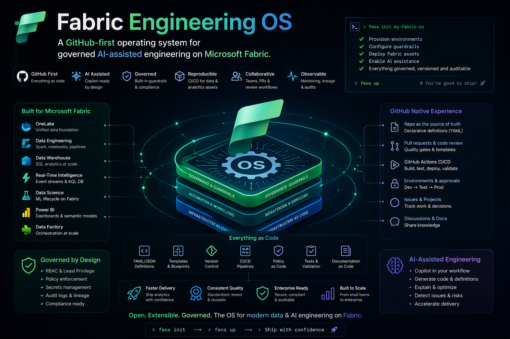

# Fabric Engineering OS

A GitHub-first operating system for governed AI-assisted engineering on Microsoft Fabric.

> All use and contribution is governed by the [Fabric Engineering OS Constitution](CONSTITUTION.md).

## What this repository is

Fabric Engineering OS is a governed set of agent roles, decision aids, capability guidance, golden paths, and bootstrap assets for teams that build exclusively on Microsoft Fabric. It turns GitHub Copilot into a bounded engineering runtime while preserving human accountability.

This preview is designed to be used as a GitHub template. It does not install or alter Microsoft Fabric tenants, upstream repositories, or production environments.

## Operating model

| Concern | Source |
| --- | --- |
| Platform | Microsoft Fabric only |
| Agent runtime | GitHub Copilot |
| Repository interface | GitHub MCP |
| Microsoft product truth | Microsoft Learn MCP |
| Preferred Fabric expertise | Skills for Fabric |
| Primary architecture reference | Fabric Accelerator |
| Primary implementation reference | FMD Framework |
| Secondary implementation reference | ELT Framework |
| Optional discovery | Fabric Toolbox |

Upstream sources are references, not managed dependencies. Agents must never modify them automatically.

## Human and agent boundaries

Agents may create issues, branches, commits, and pull requests, and may deploy approved changes to DEV and TEST. Humans remain accountable for architecture approval, pull request approval, merge approval, and production approval.

Agents must never merge, self-approve, deploy to PROD, modify this OS automatically, or modify an upstream repository automatically. See [Governance](GOVERNANCE.md) for the complete control model.

## Start here

1. Read the [Constitution](CONSTITUTION.md).
2. Choose a scenario from [Agent Bundles](agent-bundles/README.md) or [Golden Paths](golden-paths/README.md).
3. Use the [Capability Catalog](capabilities/README.md) and [Decision Trees](decision-trees/README.md) to make bounded choices.
4. Start a repository with a [Bootstrap Guide](bootstrap/README.md).
5. Submit work through the [Contribution Guide](community/CONTRIBUTING.md).

## Repository map

| Path | Purpose |
| --- | --- |
| [`agents/`](agents/README.md) | Composable engineering roles and approval boundaries |
| [`agent-bundles/`](agent-bundles/README.md) | Scenario-specific teams, prompts, tests, and success criteria |
| [`capabilities/`](capabilities/README.md) | Fabric capability selection guidance |
| [`golden-paths/`](golden-paths/README.md) | Repeatable delivery paths |
| [`patterns/`](patterns/README.md) | Reusable engineering patterns |
| [`reference-architectures/`](reference-architectures/README.md) | Opinionated Fabric architecture baselines |
| [`bootstrap/`](bootstrap/README.md) | Project and feature startup guides |
| [`standards/`](standards/README.md) | Engineering and governance standards |
| [`decision-records/`](decision-records/README.md) | Fabric Decision Records and template |
| [`decision-trees/`](decision-trees/README.md) | Bounded decision support |
| [`metadata/`](metadata/README.md) | Versioned machine-readable operational metadata |
| [`community/`](community/README.md) | Contribution, maintenance, and release practices |
| [`wiki/`](wiki/Home.md) | Source-controlled adopter documentation |

## Status

The repository is preparing **v0.9.0-preview**. Preview content must be validated against the target tenant, region, capacity, licensing, and current Microsoft Learn documentation before implementation.

Using this repository as a template? See [Template Usage](TEMPLATE-USAGE.md). To report a vulnerability, see the [Security Policy](SECURITY.md). Notable changes are tracked in the [Changelog](CHANGELOG.md).