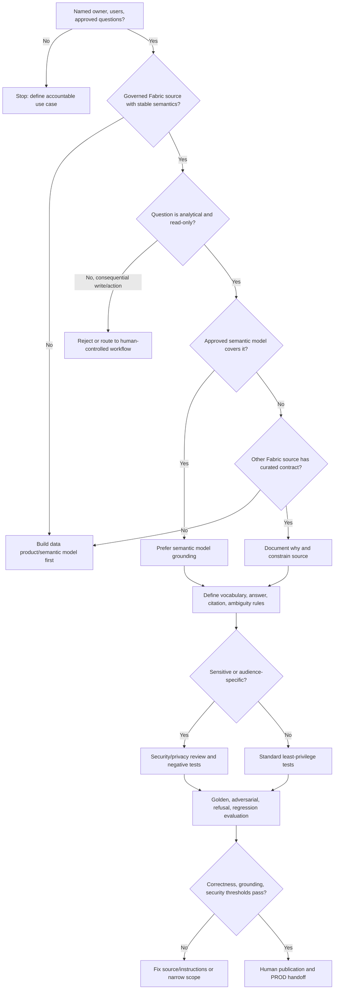

# Data Agent Decision Tree

This tree follows the [Fabric Engineering OS Constitution](../../CONSTITUTION.md) and [data-agent golden path](../../golden-paths/data-agent.md).

Prefer the [semantic model capability](../../capabilities/semantic-model.md) for governed metrics and use [Data Agents](../../capabilities/data-agent.md) only for explicitly bounded questions.
