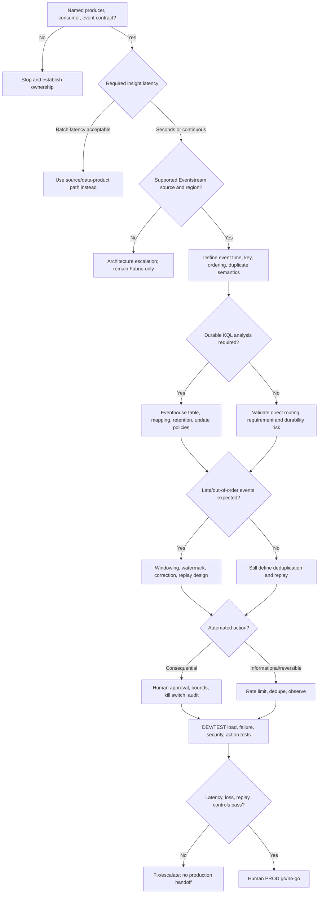

# Eventhouse RTI Decision Tree

This tree follows the [Fabric Engineering OS Constitution](../../CONSTITUTION.md) and [eventhouse-rti golden path](../../golden-paths/eventhouse-rti.md).

Confirm current feature availability in Microsoft Learn and the [Real-Time Intelligence capability](../../capabilities/real-time-intelligence.md); preview or regional availability must never be assumed.
