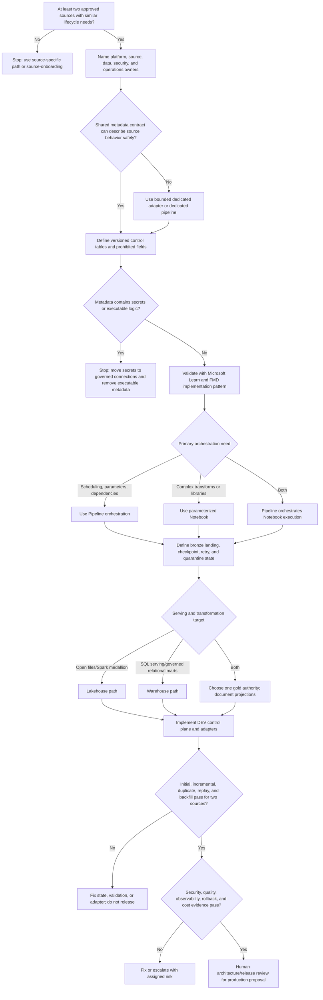

# Metadata-Driven ELT Decision Tree

This tree follows the [Fabric Engineering OS Constitution](../../CONSTITUTION.md), [metadata-driven ELT golden path](../../golden-paths/metadata-driven-elt.md), and [reference architecture](../../reference-architectures/metadata-driven-elt.md).

Use [Pipeline](../../capabilities/pipeline.md), [Notebook](../../capabilities/notebook.md), [Lakehouse](../../capabilities/lakehouse.md), and [Warehouse](../../capabilities/warehouse.md) guidance to keep orchestration, transformation, and serving decisions explicit.
