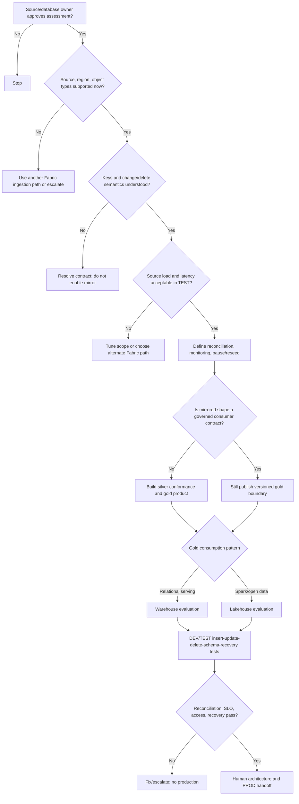

# Mirroring to Gold Decision Tree

This tree follows the [Fabric Engineering OS Constitution](../../CONSTITUTION.md) and [mirroring-to-gold golden path](../../golden-paths/mirroring-to-gold.md).

Use [Mirroring](../../capabilities/mirroring.md) only after current eligibility validation. A mirrored replica is neither a backup nor automatically a gold data product.
