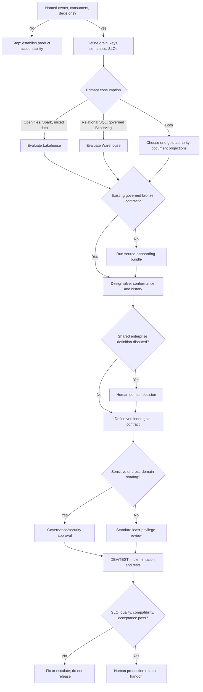

# New Data Product Decision Tree

This tree follows the [Fabric Engineering OS Constitution](../../CONSTITUTION.md) and [data-product golden path](../../golden-paths/data-product.md).

Use [Lakehouse](../../capabilities/lakehouse.md) and [Warehouse](../../capabilities/warehouse.md) guidance to make the serving decision. Avoid dual authorities for the same gold contract.
