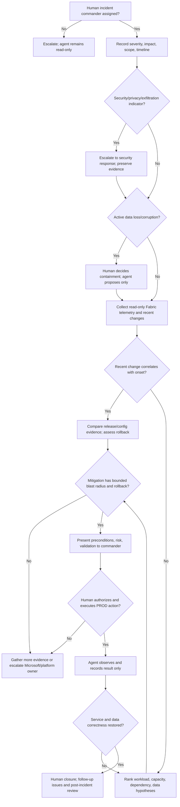

# Production Incident Decision Tree

This tree follows the [Fabric Engineering OS Constitution](../../CONSTITUTION.md) and [production-incident golden path](../../golden-paths/production-incident.md).

The agent may use the [capability catalog](../../capabilities/README.md) and workload-specific read-only evidence, but it never interprets observability access as production change authority.
