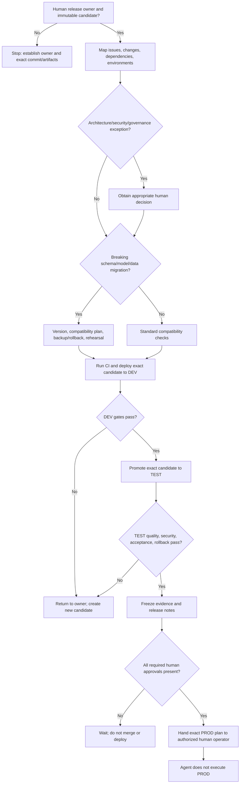

# Release Management Decision Tree

This tree follows the [Fabric Engineering OS Constitution](../../CONSTITUTION.md) and [release-management golden path](../../golden-paths/release-management.md).

Use [Deployment Pipelines](../../capabilities/deployment-pipeline.md) only where supported and reviewed. The artifact tested in TEST must be the artifact proposed for production.
