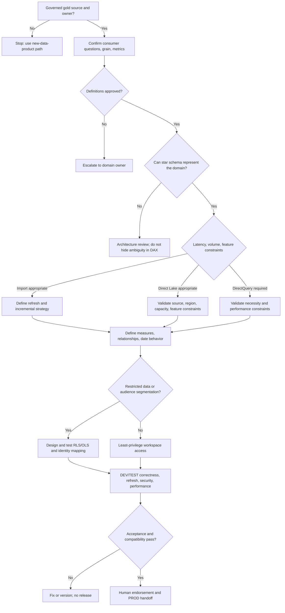

# Semantic Model Decision Tree

This tree follows the [Fabric Engineering OS Constitution](../../CONSTITUTION.md) and [semantic-model golden path](../../golden-paths/semantic-model.md).

Validate storage-mode behavior and constraints against current Microsoft Learn and the [semantic model capability](../../capabilities/semantic-model.md); do not choose a mode from preference alone.
