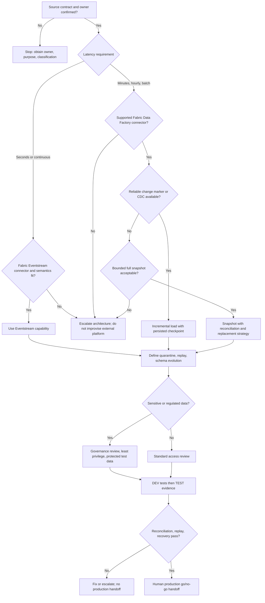

# Source Onboarding Decision Tree

This decision tree is subordinate to the [Fabric Engineering OS Constitution](../../CONSTITUTION.md) and the [source-onboarding golden path](../../golden-paths/source-onboarding.md).

Use [Data Factory pipelines](../../capabilities/pipeline.md) for scheduled/orchestrated ingestion and [Eventstream](../../capabilities/eventstream.md) for supported streaming ingestion. A connector's existence does not establish suitability: validate regional availability, authentication, limits, and semantics in current Microsoft Learn documentation.
