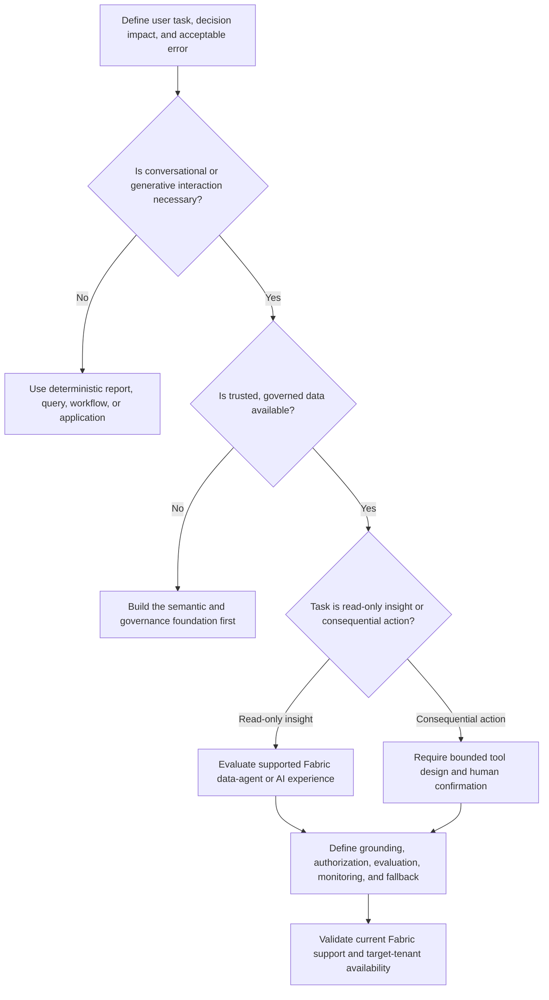

# AI and Data-Agent Decision Tree

Use this tree under the [Fabric Engineering OS Constitution](../CONSTITUTION.md) to decide whether a Fabric AI or data-agent experience is appropriate.

## Decision criteria

- Prefer deterministic experiences when they satisfy the user outcome.
- Ground responses in governed Fabric data with explicit semantic meaning and access controls.
- Evaluate answer correctness, refusal behavior, source attribution, sensitive-data handling, and prompt-injection resistance using representative scenarios.
- Require human confirmation for material, irreversible, security-sensitive, financial, or production actions.
- Keep tools least-privileged and separate read access from write authority.

## Stop conditions

Stop if the feature is unsupported or unavailable, data is not governed, identity propagation is unclear, evaluation thresholds are undefined, or users could mistake generated output for guaranteed fact. Do not promise model accuracy or autonomous correctness.

## Record

Document the user task, grounding sources, data permissions, allowed actions, evaluation set and thresholds, fallback, monitoring, limitations, and accountable owner.
