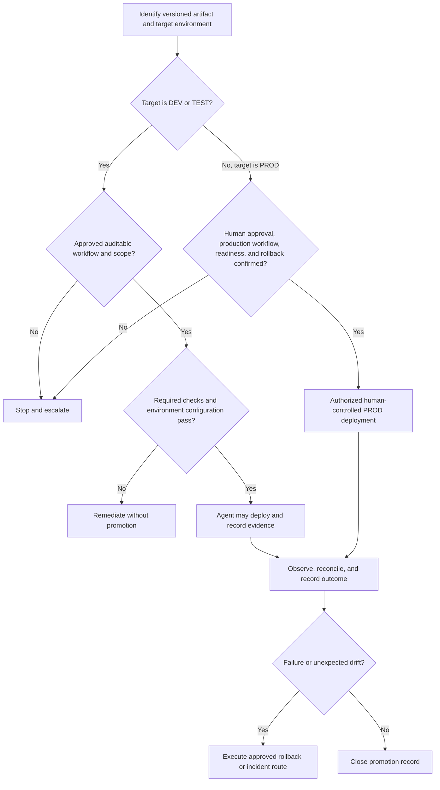

# Environment Promotion Decision Tree

Use this tree under the [Fabric Engineering OS Constitution](../CONSTITUTION.md) with the [environment promotion standard](../standards/environment-promotion.md).

## Gate checklist

- Same identified artifact, source commit, and dependency set.
- Required tests, security checks, data-quality evidence, and accepted residual risks.
- Target configuration, identity, connection, capacity, and workspace validation; use [Variable Libraries](../capabilities/variable-libraries.md) only for supported non-secret environment-specific values.
- Deployment order, compatibility, migration, rollback, monitoring, and support owner.
- Human approval for PROD; agents may never approve, initiate, or execute PROD deployment.

## Stop conditions

Stop on artifact drift, failed checks, unapproved exceptions, unknown data impact, missing rollback, or a target outside the authorized environment.

## Record

Record artifact identity, source and target, approvals, checks, workflow run, timestamps, observations, rollback status, and accountable human.
