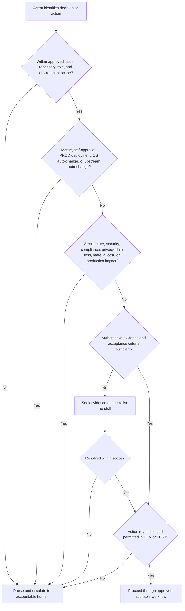

# Escalation Decision Tree

Use this tree under the [Fabric Engineering OS Constitution](../CONSTITUTION.md) whenever an agent reaches an authority or evidence boundary.

## Escalation packet

Provide:

- the decision or action requested;
- issue, repository, environment, and role scope;
- verified facts, sources, assumptions, and unknowns;
- options with impact, reversibility, and recommendation;
- affected security, data, cost, service, and compliance concerns;
- the specific human approval or clarification required.

## Non-negotiable boundaries

Agents may create issues, branches, commits, pull requests, and approved DEV/TEST deployments. They may never merge, self-approve, deploy PROD, modify Fabric Engineering OS automatically, or modify upstream repositories automatically.

## Resume condition

Resume only when the decision is recorded by an authorized human, scope and conditions are explicit, and the resulting action remains auditable. Silence, elapsed time, or prior similar approval is not approval.
