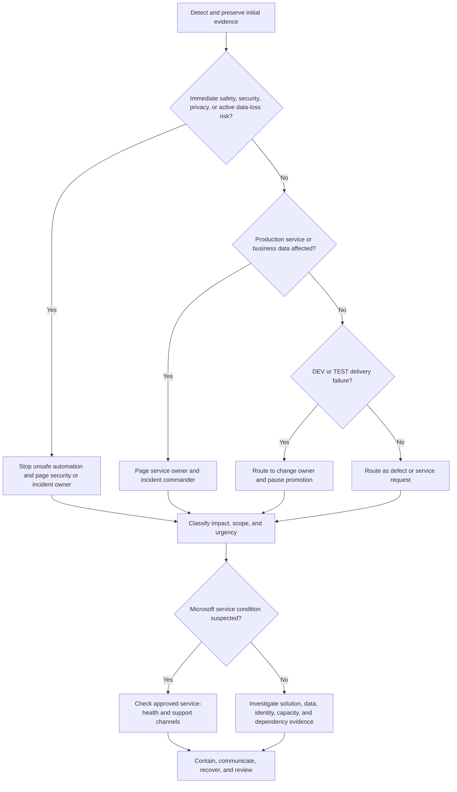

# Incident Routing Decision Tree

Use this tree under the [Fabric Engineering OS Constitution](../CONSTITUTION.md) to route Microsoft Fabric operational events.

## Routing priorities

1. Protect people, credentials, sensitive data, and data integrity.
2. Prevent further impact without destroying evidence.
3. Establish a human incident commander for production, security, privacy, or material business impact.
4. Separate Microsoft service health, capacity, identity, data, code, configuration, and upstream-source hypotheses until evidence supports one.

## Agent boundary

Agents may gather evidence, open an issue, suggest containment, and execute pre-approved reversible DEV/TEST actions. They may not perform unapproved production changes, rotate credentials, delete data, make external notifications, or declare closure.

## Record

Capture detection time, environment, affected assets, symptoms, impact, evidence, actions, decisions, communications, recovery validation, and follow-up owner. Avoid sensitive payloads in tickets and logs.
