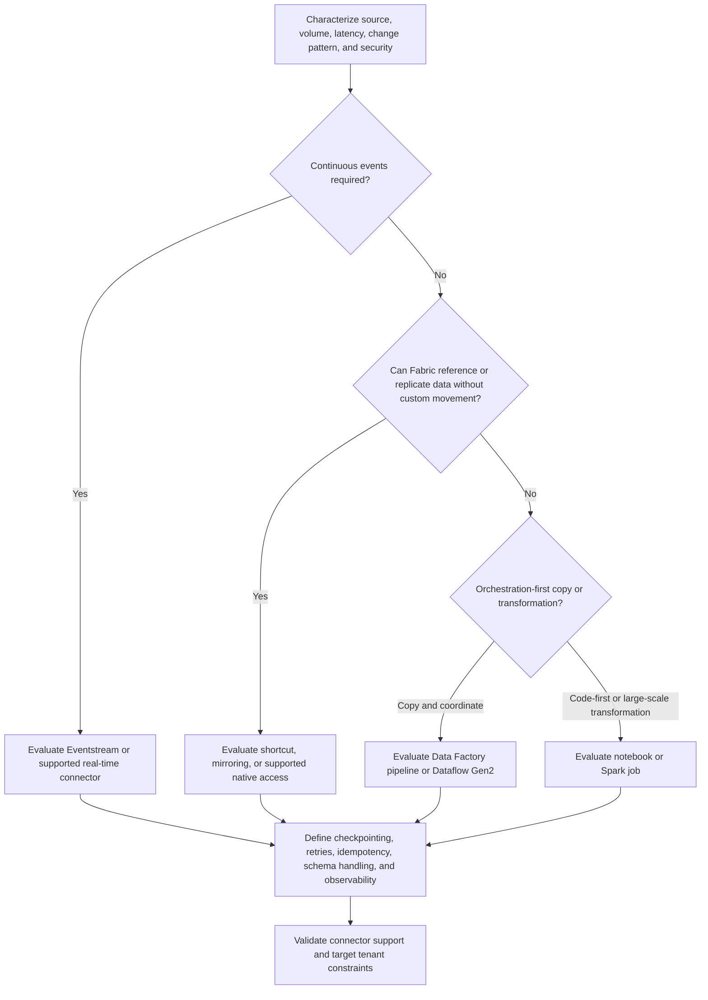

# Ingestion Decision Tree

Use this tree under the [Fabric Engineering OS Constitution](../CONSTITUTION.md) to select a bounded Fabric ingestion approach.

## Decision criteria

- Prefer the least data movement that meets freshness, isolation, governance, and recovery needs.
- Choose scheduled batch when the outcome does not justify continuous processing.
- Treat change-data behavior, ordering, duplicates, deletes, late arrivals, and schema drift as explicit contracts.
- Separate ingestion from business transformation when ownership, retry, or lineage differs.

## Stop conditions

Stop if credentials, network path, data classification, source impact, egress, connector support, recovery objective, or data owner approval is unresolved. Do not infer exactly-once behavior or connector guarantees without authoritative evidence.

## Record

Document source and destination, chosen capability, cadence, volume assumptions, failure and replay behavior, schema contract, security boundary, and validation evidence.
