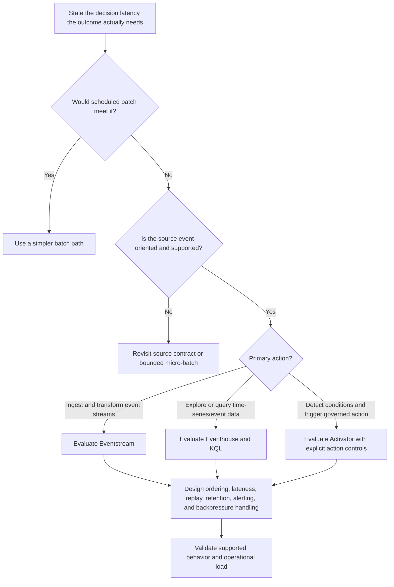

# Real-Time Decision Tree

Use this tree under the [Fabric Engineering OS Constitution](../CONSTITUTION.md) to determine whether Real-Time Intelligence is justified.

## Decision criteria

- Define measurable event-to-insight or event-to-action latency; avoid using “real time” as a vague preference.
- Model late, duplicated, missing, and out-of-order events.
- Bound automated actions with identity, rate, retry, idempotency, audit, and human intervention controls.
- Provide replay and degradation paths where the business outcome requires them.

## Stop conditions

Stop if the source contract, connector support, acceptable data loss, action authority, capacity behavior, or on-call ownership is unknown. Do not promise latency or delivery semantics without representative testing and current documentation.

## Record

Record the latency objective, event contract, selected capability, action boundary, failure modes, retention, replay, and tested operating envelope.
