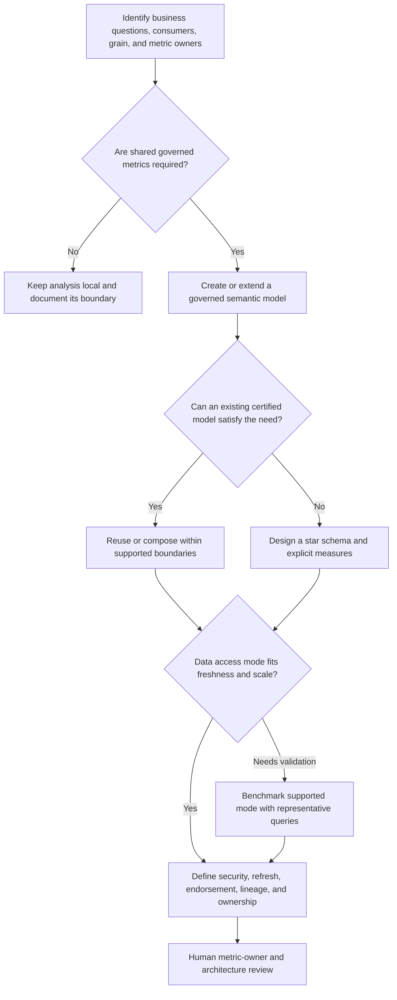

# Semantic Layer Decision Tree

Use this tree under the [Fabric Engineering OS Constitution](../CONSTITUTION.md) to shape a governed Power BI semantic layer in Microsoft Fabric.

## Decision criteria

- Establish grain, dimensions, facts, relationships, and measure definitions before report-specific optimization.
- Reuse governed models and measures; avoid duplicating business logic across reports.
- Treat row-level and object-level security as designed controls with explicit identity tests.
- Select storage and connectivity modes only after validating freshness, scale, concurrency, and operational constraints.

## Stop conditions

Stop if metric ownership, semantic definitions, data lineage, security identity, refresh responsibility, or representative performance evidence is missing. Do not claim a model is certified or authoritative without human governance.

## Record

Document metric owners, grain, source lineage, model boundaries, security, refresh, endorsement target, performance evidence, and known limitations.
