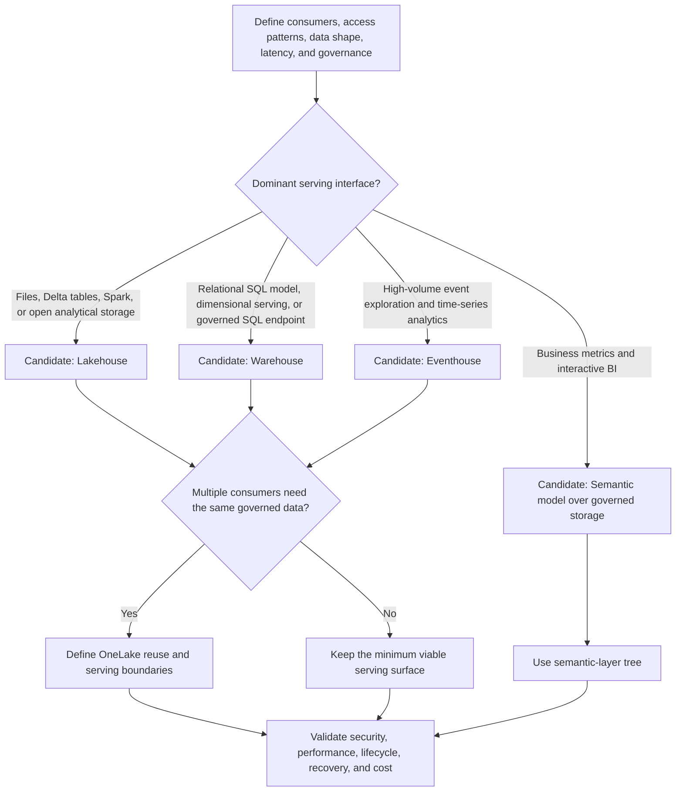

# Storage and Serving Decision Tree

Use this tree under the [Fabric Engineering OS Constitution](../CONSTITUTION.md) to choose storage and serving candidates in Microsoft Fabric.

## Decision criteria

- Separate system-of-record responsibility from analytical serving responsibility.
- Optimize for the dominant query and maintenance pattern; do not duplicate data solely for tool familiarity.
- Define table format, partitioning, retention, history, schema evolution, and quality ownership before implementation.
- Add a serving surface only when it has a named consumer, service expectation, and owner.

## Stop conditions

Stop if data residency, sensitivity, recovery, retention, concurrency, workload isolation, or authoritative product limits are unknown. Benchmark representative data in DEV/TEST before making performance commitments.

## Record

Capture storage owner, serving interfaces, data contracts, expected scale, lifecycle, security model, rejected candidates, and benchmark limitations.
