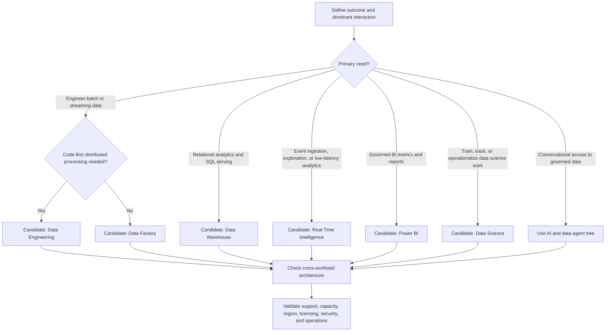

# Workload and Capability Selection

Use this tree under the [Fabric Engineering OS Constitution](../CONSTITUTION.md) to select a leading Microsoft Fabric workload.

## Capability routes

- For **Data Engineering**, evaluate [Lakehouse](../capabilities/lakehouse.md) and [Notebook](../capabilities/notebook.md); treat Spark runtime and Fabric Environment as supporting execution decisions.
- For **Data Factory**, evaluate [Pipeline](../capabilities/pipeline.md) and [Dataflows Gen2](../capabilities/dataflows-gen2.md).
- For **Real-Time Intelligence**, continue through the [real-time decision tree](real-time.md), including [Activator](../capabilities/activator.md) when governed action is required.
- For environment-specific promotion values across workloads, evaluate [Variable Libraries](../capabilities/variable-libraries.md) after selecting the leading workload.

## Decision criteria

- Choose the dominant workload by the primary engineering and operational responsibility, not by where a demo is easiest.
- Compose workloads only when each has a clear boundary, owner, interface, and support need.
- Prefer native Fabric integration and OneLake reuse where it satisfies security and lifecycle requirements.
- Use the specific ingestion, storage, real-time, semantic, or AI tree before fixing detailed capabilities.

## Stop conditions

Stop and escalate if the outcome requires a non-Fabric implementation target, the product behavior is undocumented, or capacity, licensing, region, tenant policy, ownership, or production support is unresolved.

## Record

Capture the chosen lead workload, supporting workloads, rejected alternatives, authoritative sources, tenant validation, and accountable architecture approver.
