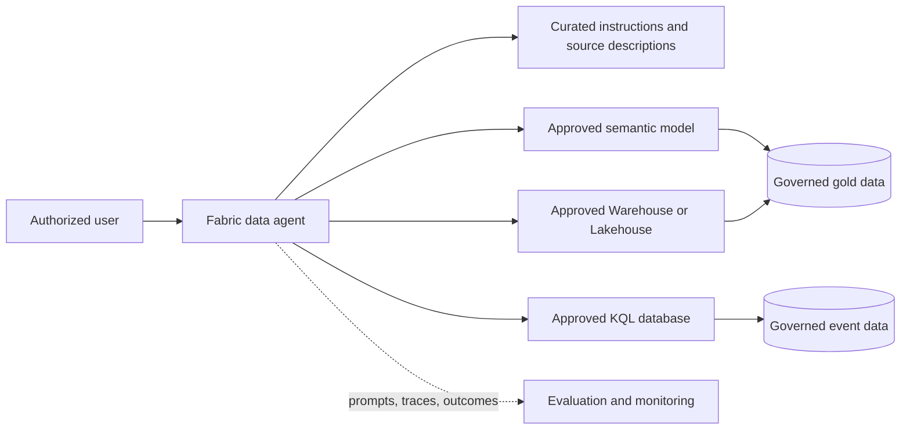

# Data Agent Reference Architecture

This architecture is governed by the root [Fabric Engineering OS Constitution](../CONSTITUTION.md).

## Scope

Provide bounded natural-language discovery and analysis over approved Fabric sources while preserving source permissions, semantic meaning, and evaluation evidence.

## Context and source posture

[Fabric Accelerator](https://github.com/microsoft/unified-data-foundation-with-fabric-solution-accelerator) is the primary architecture reference and is not copied or automatically synchronized. Validate supported data sources, configuration, permissions, and current limitations with [Microsoft Learn: Fabric data agents](https://learn.microsoft.com/fabric/data-science/concept-data-agent).

## Components

- Narrow purpose, audience, owner, and refusal policy.
- Curated approved sources with descriptions and synonyms.
- Governed semantic model or selected Warehouse/Lakehouse/KQL surfaces.
- Versioned agent instructions and evaluation dataset.
- Access control, usage monitoring, support runbook, and feedback route.

## Data, security, and operations concerns

Source contracts and permissions remain authoritative; the agent must not become an access bypass. Minimize sources and exposed fields, classify prompts/traces, and define retention. Track source, instruction, and evaluation versions. Monitor wrong-answer rate, unresolved ambiguity, denied access, latency, and usage without retaining unnecessary sensitive content.

## Alternatives and trade-offs

- Prefer a semantic model when shared metrics and business language dominate.
- Use direct Warehouse/Lakehouse/KQL grounding for bounded technical exploration when semantics are documented.
- Use reports or curated query experiences when deterministic interaction is more important than natural language.

## Deployment boundaries

Instructions, source selections, and test cases are reviewed artifacts. Workspace identities and connections differ by environment. Agents may deploy and run evaluation in DEV/TEST; human owners approve architecture, data scope, PR, merge, and PROD availability.

## Validation checklist

- [ ] Deterministic queries reconcile every critical evaluation answer.
- [ ] Ambiguous, unsupported, adversarial, and out-of-scope prompts behave as specified.
- [ ] Users cannot retrieve data denied by the source.
- [ ] Source and instruction changes trigger regression evaluation.
- [ ] Support owner, feedback route, and disable procedure are tested.
- [ ] No secrets or unnecessary sensitive prompt content are retained.

## Related guidance

[Data agent golden path](../golden-paths/data-agent.md) · [Grounded data agent](../patterns/grounded-data-agent.md) · [Governed semantic layer](../patterns/governed-semantic-layer.md) · [Data agent capability](../capabilities/data-agent.md)
