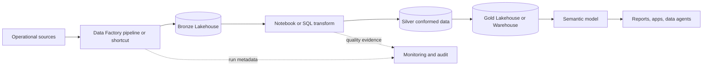

# Data Product Reference Architecture

This architecture is governed by the root [Fabric Engineering OS Constitution](../CONSTITUTION.md).

## Scope

Build a domain-owned, batch-oriented Fabric data product that preserves raw evidence and publishes governed gold interfaces. Streaming-first use cases belong in the [Eventhouse RTI architecture](eventhouse-rti.md).

## Context and source posture

[Fabric Accelerator](https://github.com/microsoft/unified-data-foundation-with-fabric-solution-accelerator) is the primary architecture reference. It is not copied or automatically synchronized here. Confirm Lakehouse, Warehouse, OneLake, notebook, pipeline, and semantic-model behavior with [Microsoft Learn](https://learn.microsoft.com/fabric/) for the target tenant, region, capacity, and license.

## Components

- Source adapter or OneLake shortcut selected per source.
- Bronze Lakehouse with ingestion metadata and replay boundary.
- Silver transformations for typing, keys, deduplication, and quality.
- Gold Lakehouse or Warehouse exposing versioned product contracts.
- Optional semantic model for governed measures and security.
- GitHub source, approved deployment workflow, monitoring, and runbooks.

## Data, security, and operations concerns

Define grain, keys, classification, retention, quality, freshness, and change policy before ingestion. Separate producer, operator, deployment, and consumer access; apply least privilege at workspace, item, and data layers. Monitor freshness, failed partitions, quarantines, contract violations, capacity, and cost. Retain code, metadata version, run ID, and lineage evidence.

## Alternatives and trade-offs

- Prefer a shortcut over copying when source ownership, availability, performance, and policy allow it; materialize for isolation, retention, transformation, or measured performance needs.
- Use Warehouse for T-SQL-centric serving and relational constraints; use Lakehouse for Spark/Delta-centric engineering. Validate current feature support.
- Collapse physical medallion layers only with documented equivalent replay, quality, and access controls.

## Deployment boundaries

Source code and environment-neutral definitions move as one reviewed candidate. Environment identities, connections, capacity, and secrets are externally configured. Agents may deploy approved work to DEV and TEST only. Human owners approve the architecture and PR; humans merge and perform/approve PROD promotion.

## Validation checklist

- [ ] Contract tests cover schema, keys, quality, freshness, classification, and compatibility.
- [ ] Replay and duplicate-input tests produce deterministic results.
- [ ] Gold measures reconcile to source-controlled queries.
- [ ] Allowed and denied access paths are tested.
- [ ] Monitoring identifies source-to-gold latency and failing partition.
- [ ] TEST rollback restores the prior artifact and compatible data state.

## Related guidance

[Data product golden path](../golden-paths/data-product.md) · [Source onboarding](../golden-paths/source-onboarding.md) · [Semantic model](../golden-paths/semantic-model.md) · [Medallion pattern](../patterns/medallion-data-product.md) · [Lakehouse capability](../capabilities/lakehouse.md) · [Warehouse capability](../capabilities/warehouse.md)
