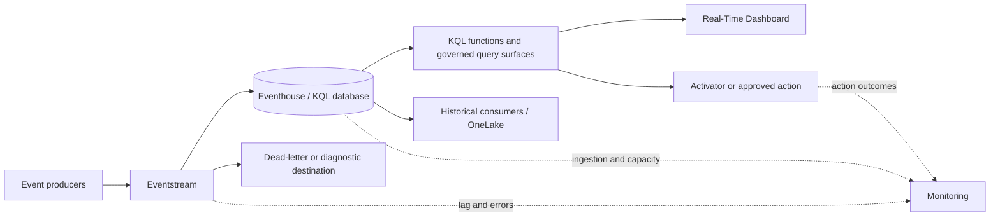

# Eventhouse Real-Time Intelligence Reference Architecture

This architecture is governed by the root [Fabric Engineering OS Constitution](../CONSTITUTION.md).

## Scope

Ingest governed event streams into Eventhouse/KQL databases for low-latency analytics, optional activation, and historical consumption.

## Context and source posture

[Fabric Accelerator](https://github.com/microsoft/unified-data-foundation-with-fabric-solution-accelerator) is the primary architecture reference; it is neither copied nor synchronized. Validate Eventstream, Eventhouse, KQL database, Real-Time Dashboard, and [Activator](../capabilities/activator.md) behavior with [Microsoft Learn: Real-Time Intelligence](https://learn.microsoft.com/fabric/real-time-intelligence/overview).

## Components

- Versioned producer event contract and partition strategy.
- Eventstream for routing and bounded transformation.
- Eventhouse/KQL database with retention, update policy, and query functions.
- Dead-letter/diagnostic route and replay boundary.
- Real-Time Dashboard and optional Activator with owned action runbook.
- Telemetry for producer lag, ingestion, queries, actions, and capacity.

## Data, security, and operations concerns

Preserve event time, ingestion time, source identity, schema version, and correlation ID. Define duplicate, ordering, late-arrival, malformed-event, retention, and replay policies. Separate query users from event publishers and action identities. Protect sensitive payloads and prevent telemetry from echoing secrets. Capacity and hot-cache assumptions require load testing.

## Alternatives and trade-offs

- Use batch Lakehouse processing when latency objectives do not justify streaming complexity.
- Route curated events to Lakehouse for broader historical engineering, accepting extra latency.
- Avoid automated actions when alert plus human response satisfies the outcome with less risk.

## Deployment boundaries

Producer contracts, transformations, KQL functions, and alert definitions are versioned. Connections, endpoints, identities, and action destinations are environment-specific. Agents may deploy approved DEV/TEST assets; humans approve architecture, PR, merge, action risk, and PROD.

## Validation checklist

- [ ] Throughput and p95 end-to-end latency meet the stated objective.
- [ ] Duplicate, late, out-of-order, malformed, and schema-version cases pass.
- [ ] Retention, replay, and dead-letter recovery are proven.
- [ ] Query and action identities pass least-privilege tests.
- [ ] Alerts identify lag, ingestion failure, capacity pressure, and failed actions.
- [ ] TEST rollback disables actions and restores prior queries/routes safely.

## Related guidance

[Eventhouse RTI golden path](../golden-paths/eventhouse-rti.md) · [Real-time event pattern](../patterns/real-time-event-processing.md) · [Observability pattern](../patterns/observability-by-default.md) · [Real-Time Intelligence capability](../capabilities/real-time-intelligence.md)
