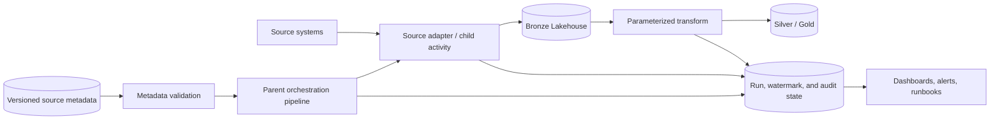

# Metadata-Driven ELT Reference Architecture

This architecture is governed by the root [Fabric Engineering OS Constitution](../CONSTITUTION.md).

## Scope

Onboard multiple batch sources through shared, configuration-driven Fabric ingestion and transformation while retaining source isolation and auditable run state.

## Context and source posture

[Fabric Accelerator](https://github.com/microsoft/fabric-accelerator) is the primary architecture reference; this baseline neither copies nor synchronizes it. Validate Data Factory, Lakehouse, Warehouse, notebook, connection, and monitoring behavior with [Microsoft Learn: Data Factory in Fabric](https://learn.microsoft.com/fabric/data-factory/data-factory-overview).

## Components

- Versioned metadata contract with source, object, cadence, watermark, destination, and policy fields.
- Preflight validator that rejects invalid or incompatible configuration.
- Parent pipeline and bounded adapters for source-specific behavior.
- Bronze replay boundary and parameterized silver/gold transforms.
- Durable run, checkpoint, quality, configuration-version, and lineage state.
- Monitoring and per-source operational ownership.

## Data, security, and operations concerns

Treat metadata as controlled code: review changes, validate values, and prohibit embedded secrets or arbitrary executable expressions. Isolate source identities and failures. Advance watermarks only after durable publication. Define concurrency, backfill, retry, quarantine, schema drift, retention, and cost controls.

## Alternatives and trade-offs

- Use dedicated pipelines when the source lifecycle is materially unique; retain common evidence contracts.
- Prefer shortcuts or Mirroring when they meet freshness and control needs with less orchestration.
- Use notebooks for complex transformations and pipelines for orchestration; avoid placing untestable business logic in activity expressions.

## Deployment boundaries

Orchestrator code, metadata schema, and safe configuration are promoted together; credentials, connections, workspace IDs, and schedules remain external. Agents may deploy approved DEV/TEST candidates. Humans approve architecture, PR, merge, broad metadata changes, and PROD.

## Validation checklist

- [ ] Invalid metadata fails before source access or writes.
- [ ] Two representative sources pass initial, incremental, retry, and backfill tests.
- [ ] Duplicate execution is idempotent and watermarks never skip unpublished data.
- [ ] One source failure cannot corrupt another source or shared state.
- [ ] Every output traces to code, metadata version, run ID, and source checkpoint.
- [ ] TEST rollback covers orchestrator, metadata, and compatible state.

## Related guidance

[Metadata-driven ELT golden path](../golden-paths/metadata-driven-elt.md) · [Metadata orchestration pattern](../patterns/metadata-driven-orchestration.md) · [Idempotent processing](../patterns/idempotent-processing.md) · [Pipeline capability](../capabilities/pipeline.md)
