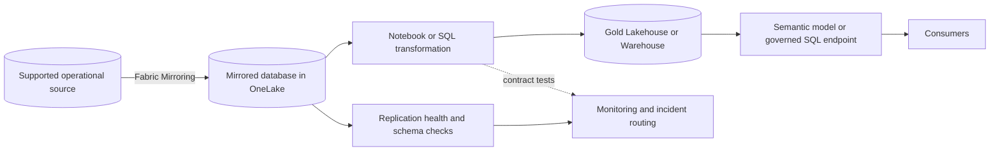

# Mirroring-to-Gold Reference Architecture

This architecture is governed by the root [Fabric Engineering OS Constitution](../CONSTITUTION.md).

## Scope

Use supported Fabric Mirroring to replicate an operational source into OneLake, then transform approved mirrored data into consumer-owned gold products.

## Context and source posture

[Fabric Accelerator](https://github.com/microsoft/fabric-accelerator) is the primary architecture reference and remains read-only; no content or synchronization is implied. Validate supported sources, limitations, security, monitoring, and replication behavior with [Microsoft Learn: Mirroring in Fabric](https://learn.microsoft.com/fabric/database/mirrored-database/overview).

## Components

- Supported source and dedicated least-privilege replication identity.
- Fabric mirrored database as source-aligned replicated data.
- Replication health, latency, and schema-change monitoring.
- Transformation boundary that isolates source schema from gold contracts.
- Gold Lakehouse/Warehouse and optional governed semantic model.

## Data, security, and operations concerns

Record source owner, supported tables, keys, deletes, schema evolution, expected latency, initial-load impact, retention, and classification. Do not treat a mirrored database as a consumer contract. Restrict replicated sensitive columns and test downstream permissions. Alert on replication stalls, rejected tables, schema drift, and gold freshness.

## Alternatives and trade-offs

- Use a OneLake shortcut when data already exists in an accessible supported location and source dependency is acceptable.
- Use pipeline copy or CDC ingestion when Mirroring does not support the source or required control.
- Query mirrored data directly only for source-aligned exploration; publish stable consumers through gold.

## Deployment boundaries

Connection and source permissions are environment-specific and never stored as secrets in Git. Gold transformations are promoted as immutable candidates. Agents may configure/deploy approved DEV and TEST candidates; human owners approve architecture, PR, merge, source production impact, and all PROD actions.

## Validation checklist

- [ ] Current Microsoft Learn confirms source and table support.
- [ ] Initial and incremental replication meet measured latency objectives.
- [ ] Insert, update, delete, schema-change, pause, and recovery behavior are tested.
- [ ] Gold contract insulates consumers from a safe source schema change.
- [ ] Identity and sensitive-column access pass allowed/denied tests.
- [ ] A documented fallback can pause gold publication without losing source evidence.

## Related guidance

[Mirroring-to-gold golden path](../golden-paths/mirroring-to-gold.md) · [Shortcut before copy](../patterns/shortcut-before-copy.md) · [Medallion data product](../patterns/medallion-data-product.md) · [Mirroring capability](../capabilities/mirroring.md)
